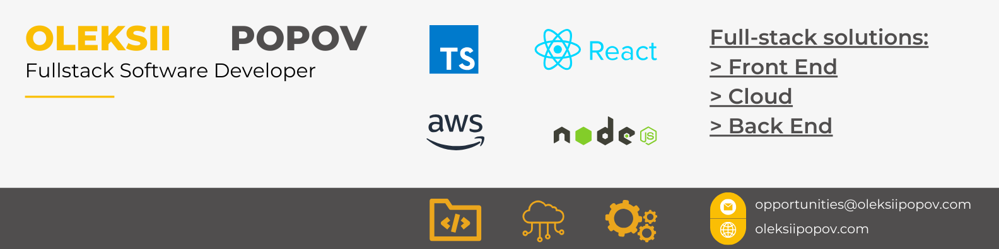

Hi, I'm Oleksii Popov 👋

**Front End Heavy Full Stack Software Developer** 💻

I am a Front End Heavy Full Stack Software Developer with more than 12 years of experience in web technologies. Passionate about developing user-friendly products and have a track record of designing and implementing full-stack solutions, combining frontend, cloud native, and backend areas.

My expertise lies in the architecture and development of high-scale single page applications, UI libraries, and SDKs, as well as in the implementation of CI/CD, hosting and distribution solutions. I am proficient in TypeScript and JavaScript across all stacks and use them whenever possible. However, I am also experienced in maintaining projects in other languages.

Enthusiastic about optimizing applications for improved runtime and faster loading speeds, both for existing projects and new ones. 🚀

### Links
- [Blog](https://oleksiipopov.com/blog/) 📝
- [CV](https://oleksiipopov.com/resume/) 📄
- [Portfolio](https://oleksiipopov.com/portfolio/) 🎨