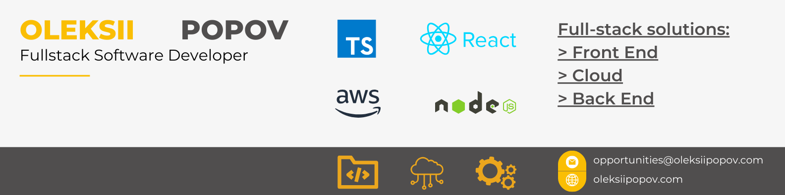

Hi, I'm Oleksii Popov 👋

**Front End Leaning Full Stack Software Developer** 💻

I'm a front-end leaning full-stack software developer with 14 years of experience, including 7 in senior roles.

I build user-centric products, leveraging my expertise across frontend, cloud-native, and backend technologies.

I specialize in architecting and developing high-scale single-page applications, UI libraries, and SDKs, while also implementing CI/CD pipelines, hosting, and distribution solutions.

I excel at optimizing application performance for improved runtime efficiency and faster load speeds.

My experience includes leading the development of high-quality technical solutions, conducting technical interviews, and mentoring team members.

I also bring experience in defining project visions, setting development strategies, and prioritizing technologies to align with business goals.

Currently building [Coloring Magic Art](https://coloringmagic.art) — custom printable coloring books with AI. If you're curious, I'd love you to check it out.

### Links
- [Blog](https://oleksiipopov.com/blog/) 📝
- [CV](https://oleksiipopov.com/resume/) 📄
- [Portfolio](https://oleksiipopov.com/portfolio/) 🎨
